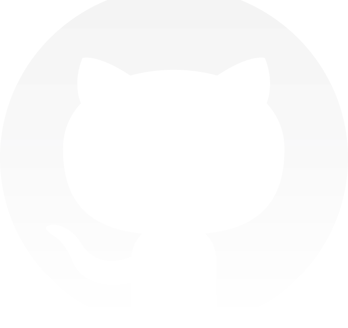

# Lello - Gihub explorer - React⚛ + Typescript + Styled components

<hr>

<h1 align="center">
    Lello - Github explorer <br>
  

</h1>

<p align="center">

  
  
  
  
</p>

<br>

## 🚀 Required Tools

[Node](https://nodejs.org/en/download/)
[Yarn](https://yarnpkg.com/)
[Git](https://git-scm.com/downloads)

## 💻 Project - Projeto - [🔗Github cards](https://github.com/sunderhus/FrontendChallenge/projects/1)

<p>This project aims to enable repository members search and personal github user informations.</p><br>
<p>Este projeto possibilita a busca de membros em um repositório do github bem como informações de um usuário do github.</p>

## 🔖 Layout

This layout was buil without any base design. <br>

Este leyout foi construído sem um design prévio.

## 🧠 Steps and time - Etapas e tempo necessário

✅ Criar cards para gerenciamento de atividade no github ⌛ 32 minutos; <br>
✅ Criar estrutura inicial, limpeza de código e instalação de bibliotecas ⌛ 45 minutos ; <br>
✅ Adicionar e configurar formatadores de código ⌛ 1 hora e 24 minutos<br>
✅ Caso de uso, listagem de membros ⌛ 30 minutos<br>
✅ Caso de uso, mostrar informações de usuário selecionado ⌛ 20 minutos<br>
✅ Caso de uso, criar campo de pesquisa ⌛ 53 minutos<br>
✅ Refatorar estilos dos components e página inicial ⌛ 2 horas e 27 minutos<br>
✅ Refatorar código para melhorar semântica e compartilhamento de informações ⌛ 1 hora e 33 minutos <br>
✅ Criação de documentação ⌛ 32 minutos<br>

## ❔ How to execute - Como executar

```bash
# Clone repository
$ git clone https://github.com/sunderhus/FrontendChallenge

# After clone, open on your favorite IDE, in my case Visual Studio Code.
# Após o clone, abra em seu ambiente de desenvolvimento favorito, no meu caso usarei o Visual Studio Code.

$ cd FrontendChallenge && code .

# install all dependencies - instalar todas as dependências
$ yarn

# run project - inicializar o projeto.
$ yarn start

```

## 📄-License

This project is under MIT License. check-out this file here 👉 [LICENSE](LICENSE.md).

---

Made by Matheus Sunderhus : [Linkedin!](https://www.linkedin.com/in/matheus-sunderhus/)
